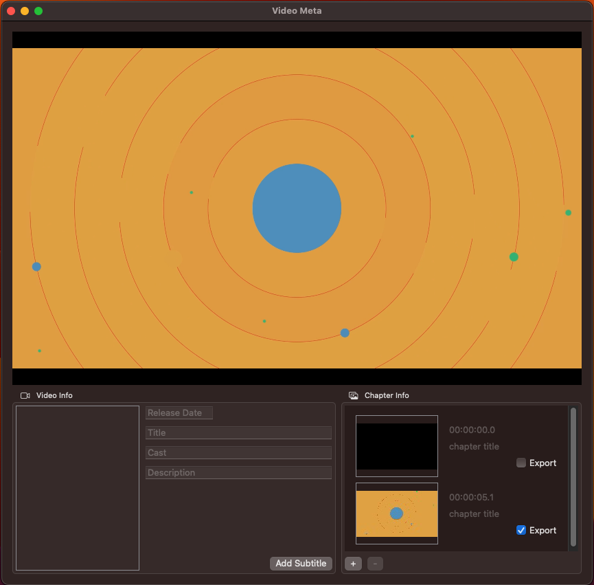

# QuickTime Movie Editing Using AVFoundation and Swift 5

## Introduction

I have a collection of movies that I manage using Plex. To fully utilize the rich Plex features, such as grouping by genres and jumping to selected chapters, I need to embed genre metadata and chapter markers in the movie file for Plex to use.

I used to use iFlicks for this task. However, despite being a full-feature metadata editing tool, I found its interface too complex for my simple purpose. Also, its chapter feature sometimes fails and creates multiple chapters with same time markers.

So I decided to create my own tool. To my surprise, documentations I could find online about adding chapter markers are extremely rare and full of mistakes and errors. They are also mostly outdated and the majority of them uses Objective-C code examples.

After reading hundreds of such articles, experimenting with various coding approaches, and then compare my outputs with the files produced by iFlicks using a hex editor, I finally figured out how chapter markers work and the proper way of adding them to a movie file.

## Video Meta

I called my new tool Video Meta. It is now on GitHub. Here is how it looks like.



The top section is a video player where you can play, pause, fast-forward and fast-backward in a movie.

The bottom-left section allows me to edit the movie metadata. I can drag-drop a poster image and add metadata such as release date, title and cast. I have a “Add Subtitle” button here as a placeholder. I will add this feature later.

The bottom-right section is for editing chapter information. Click the “+” button will add a chapter marker at the current playback time. It also takes a screenshot and uses it as the chapter thumbnail. I can then edit the chapter title, or drag a different frame as thumbnail if the default screenshot is not desirable. Chapters of the movie can also be removed from the export by unchecking the “Export” box of the chapter.

Once all information has been provided, I can use the “File->Save” menu to save the movie file. Simple and straightforward, right?

## QuickTime File Format

Conceptually, a QuickTime movie contains multiple “tracks” of media data, such as video, audio and subtitle. It also has information about the movie (i.e. metadata), such as its title, release date, genre, etc.

All these information and data are stored in a “.mov” file conforming to the QuickTime File Format (QTFF) Specification. You can find it [here](https://developer.apple.com/library/archive/documentation/QuickTime/QTFF/QTFFPreface/qtffPreface.html). In a nutshell, the movie file is organized using “atoms” (also referred to as “boxes”). The QTFF Specification defines the purpose and structure of each atom.

I won’t get into too much low-level details here. However, if you are interested in understanding why certain code was written that way, I recommend that you at least read these sections.

* Track Header Atoms
* Track Reference Atoms
* Sample Description Atoms
* Video Sample Description
* Text Sample Description

## AVFoundation

Movie editing on Apple devices is usually done by using AVFoundation classes such as AVAssetReader, AVAssetWriter, AVVideoCompoistion, etc. These classes classes provide powerful low-level controls over how you manipulate the movie, but for my simple purpose of adding chapter markers they are a little overkill.

In [WWDC15 #506 - Editing Movies in AV Foundation](https://developer.apple.com/videos/play/wwdc2015/506/), Tim Monroe showcased how to use the new [AVMutableMovie](https://developer.apple.com/documentation/avfoundation/avmutablemovie) and [AVMutableMovieTrack](https://developer.apple.com/documentation/avfoundation/avmutablemovietrack) classes to edit QuickTime movie files. Although 7 years have passed, I could found almost no example code using these “new” classes!

I found this strange, given how easy it is to use these new classes. For example, with AVMutableMovieTrack, keeping sections of the movie is as simple as a call to its `insertTimeRange(_,of:,at:,copySampleData:) ` function.

Anyway, we will be using these new classes! Hopefully someone later will find these examples helpful.

## Code Snippets

Apple’s AVFoundation API presents chapter information from an **existing** movie file as an array of AVTimedMetadataGroup objects (see documentation [here](https://developer.apple.com/documentation/avfoundation/media_playback/presenting_chapter_markers)). This created some confusion as I found multiple people (I was guilty too) trying to write chapter information as metadata using AVTimedMetadataGroup. This is incorrect.

My breakthrough started from reading the “[Track References](https://developer.apple.com/library/archive/documentation/QuickTime/QTFF/QTFFChap3/qtff3.html#//apple_ref/doc/uid/TP40000939-CH205-BBCIBFHE)” and “[Chapter Lists](https://developer.apple.com/library/archive/documentation/QuickTime/QTFF/QTFFChap3/qtff3.html#//apple_ref/doc/uid/TP40000939-CH205-57863)” sections in the QTFF Specification. The chapter markers should be added as a “text” track, and referenced by the “video” track using reference type “chap”. Apple’s API simply reads these tracks and present them as the timed metadata group array.

Besides adding text (as chapter titles), you can also add images (as chapter thumbnails). This is not mentioned in the specification but can be done similarly. The chapter title need to be added as a “text” track, and the thumbnail image need to be add as a “video” track containing still images.

All these tracks should be disabled. That is, they should not be used for normal playback. Also, one of the “main” tracks (e.g. video track) should contain a reference to all these chapter tracks.

Let’s start. First, we need to create an AVMutableMovie object.

```
// remove destination file if already exists
if FileManager.default.fileExists(atPath: exportUrl.path(percentEncoded: false)) {
    try FileManager.default.removeItem(at: exportUrl)
}

// create movie objects
guard let assetUrl = _videoInfo.url else { throw VideoExportError.invalidAsset }
let sourceMovie = AVMovie(url: assetUrl, options: [AVURLAssetPreferPreciseDurationAndTimingKey : true])
guard let newMovie = try? AVMutableMovie(settingsFrom: sourceMovie,
                                         options: [AVURLAssetPreferPreciseDurationAndTimingKey : true])
            else { throw VideoExportError.failedCreatingNewMovie }
newMovie.defaultMediaDataStorage = AVMediaDataStorage(url: exportUrl)
```

A few things worth mentioning here.

* AVMutableMovie will NOT remove the target file if it already exists. It will just fail silently. So you need to make sure you are writing to a non-existent file.
* If you need to edit the movie by adding or removing samples, it is recommended to use the `AVURLAssetPreferPreciseDurationAndTimingKey : true ` option when creating the movie object.
* When a new movie object is created, its `defaultMediaDataStorage` is set to `nil`. If you need to **add** new samples such as chapter titles and thumbnail images to the movie, you need to specify where these new samples should go to. Usually it is a good idea to directly add them to the destination file, but you could use a temporary file if you want to keep the destination file until export is successful.

Once we have the movie object, here is my code for adding these tracks. I did the following:

* Find the video track (`videoTrack`)
* Create new tracks for chapter titles (`chapterTrack`) and chapter thumbnails (`thumbnailTrack`).
* Create new timeline (`newTimeline`) for the new movie file in case certain chapters are being removed.
* For each chapter defined in the UI, if it needs to be kept:
	* Calculate its duration as the difference between its start time and the start time of the next chapter (or the end of the movie if this is the last chapter).
	* Insert the chapter time range of the original movie into the new movie using the new timeline.
	* Append new samples of the chapter title and thumbnail to the new tracks. More on this later.
* Finally, mark the new tracks as “disabled” and reference them from the video track.

```
guard let videoTrack = try? await newMovie.loadTracks(withMediaType: .video).first else { throw VideoExportError.failedCreatingNewTrack }

guard let chapterTrack = newMovie.addMutableTrack(withMediaType: .text, copySettingsFrom: nil) else { throw VideoExportError.failedCreatingNewTrack }
guard let thumbnailTrack = newMovie.addMutableTrack(withMediaType: .video, copySettingsFrom: nil) else { throw VideoExportError.failedCreatingNewTrack }

var newTimeline: CMTime = .zero
for (index, chapter) in _videoInfo.chapters.enumerated() {
    let nextChapter = (index < _videoInfo.chapters.count-1 ? _videoInfo.chapters[index+1] : nil)
    let chapterDuration = (nextChapter != nil ? nextChapter!.time - chapter.time : sourceDuration - chapter.time)
    if chapter.keep {
        let timeRange = CMTimeRange(start: newTimeline, duration: chapterDuration)
        newTimeline = newTimeline + chapterDuration

        // insert matching time range from source movie
        for (index, sourceTrack) in sourceTracks.enumerated() {
            let newTrack = newTracks[index]
            try newTrack.insertTimeRange(timeRange, of: sourceTrack, at: timeRange.start, copySampleData: true)
        }

        // add chapter track
        try await appendChapterSample(to: chapterTrack, for: chapter, on: timeRange)
        try await appendThumbnailSample(to: thumbnailTrack, for: chapter, on: timeRange)

        // update export progress
        let progress = Float((chapter.time + chapterDuration).seconds / sourceDuration.seconds)
        await progressHandler?(progress)
    }
}

chapterTrack.insertMediaTimeRange(CMTimeRange(start: .zero, duration: newTimeline), into: CMTimeRange(start: .zero, duration: newTimeline))
thumbnailTrack.insertMediaTimeRange(CMTimeRange(start: .zero, duration: newTimeline), into: CMTimeRange(start: .zero, duration: newTimeline))

videoTrack.addTrackAssociation(to: chapterTrack, type: .chapterList)
videoTrack.addTrackAssociation(to: thumbnailTrack, type: .chapterList)

chapterTrack.isEnabled = false
thumbnailTrack.isEnabled = false
```

New samples to a track should contain three pieces of information: the format description to the sample, the timing of the sample, and the sample data.

I used the following function to add new samples to the track.

```
private func appendChapterSample(to track: AVMutableMovieTrack, for chapter: Chapter, on timeRange: CMTimeRange) async throws {
    guard let formatDesc = try? createTextFormatDescription() else { throw VideoExportError.failedCreatingFormatDescription }
    guard let sampleData = try? createSampleData(from: chapter.title) else { throw VideoExportError.failedPreparingSampleData }
    try appendNewSample(from: sampleData, format: formatDesc, timing: timeRange, to: track)
}

private func appendThumbnailSample(to track: AVMutableMovieTrack, for chapter: Chapter, on timeRange: CMTimeRange) async throws {
    guard let formatDesc = try? createJpegFormatDescription(for: chapter.image) else { throw VideoExportError.failedCreatingFormatDescription }
    guard let sampleData = try? createSampleData(from: chapter.image) else { throw VideoExportError.failedPreparingSampleData }
    try appendNewSample(from: sampleData, format: formatDesc, timing: timeRange, to: track)
}
```

We will dive into details on each topic in the following sections.

### Text Sample Format Description

Each track is expecting samples conforming to the track’s media type. QTFF Specification defined many media types and their sample format.  We will look at the Text Sample Format Description and the Video Sample Format Description.

Translating from the Specification document, a text sample description should look like this.

```
// prepare sample description (reference: https://developer.apple.com/library/archive/documentation/QuickTime/QTFF/QTFFChap3/qtff3.html#//apple_ref/doc/uid/TP40000939-CH205-BBCJAJEA)
let textDescription: Array<UInt8> = [
    0x00, 0x00, 0x00, 0x3C, // 32-bit size (total sample description size 60 bytes)
    0x74, 0x65, 0x78, 0x74 // 32-bit sample type ('text')
    0x00, 0x00, 0x00, 0x00, 0x00, 0x00, // 48-bit reserved
    0x00, 0x01, // 16-bit data reference index
    0x00, 0x00, 0x00, 0x01, // 32-bit display flags
    0x00, 0x00, 0x00, 0x01, // 32-bit text justification
    0x00, 0x00, 0x00, 0x00, 0x00, 0x00, // 48-bit background color
    0x00, 0x00, 0x00, 0x00, 0x00, 0x00, 0x00, 0x00, // 64-bit default text box
    0x00, 0x00, 0x00, 0x00, 0x00, 0x00, 0x00, 0x00, // 64-bit reserved
    0x00, 0x00, // 16-bit font number
    0x00, 0x00, // 16-bit font face
    0x00, // 8-bit reserved
    0x00, 0x00, // 16-bit reserved
    0x00, 0x00, 0x00, 0x00, 0x00, 0x00, // 48-bit foreground color
    0x00 // null-terminated text name
]
```

This is a little overwhelming but luckily most of the fields are not used by chapter track. The only things we need to pay attention to is the first two elements, `size` and `sample type`.

The 32-bit size value must contain the number of bytes of the sample description (in big-endian order). Using the above example, there are in total 60 bytes in the sample description. Converting that to a 4-byte big-endian value, it is “0x00, 0x00, 0x00, 0x3C”.

The sample type value must be “text” (i.e. “0x74, 0x65, 0x78, 0x74”).

Once we have this, we can create the text formation description object using the following code.

```
var formatDesc: CMTextFormatDescription? = nil
try textDescription.withUnsafeBytes() { ptr in
    let err = CMTextFormatDescriptionCreateFromBigEndianTextDescriptionData(
        allocator: kCFAllocatorDefault,
        bigEndianTextDescriptionData: ptr.baseAddress!,
        size: textDescription.count,
        flavor: nil,
        mediaType: kCMMediaType_Text,
        formatDescriptionOut: &formatDesc)
    if err != kCVReturnSuccess { throw VideoExportError.failedCreatingFormatDescription }
}
return formatDesc
```

Note, we are using `kCMMediaType_Text ` for the mediaType parameter.

### Video Sample Format Description

As the thumbnail images should be added to a “video” track, we need to create video sample format descriptions.

Similarly, we follow the QTFF Specification by defining the following.

```
// reference: https://developer.apple.com/library/archive/documentation/QuickTime/QTFF/QTFFChap3/qtff3.html#//apple_ref/doc/uid/TP40000939-CH205-BBCGICBJ
var jpegDescription: Array<UInt8> = [
    0x00, 0x00, 0x00, 0x56, // 32-bit size (total sample description size 60 bytes)
    0x6A, 0x70, 0x65, 0x67, // 32-bit sample type ('jpeg')
    0x00, 0x00, 0x00, 0x00, 0x00, 0x00, // 48-bit reserved
    0x00, 0x00, // 16-bit data reference index
    0x00, 0x00, // 16-bit version number
    0x00, 0x00, // 16-bit revision level
    0x00, 0x00, 0x00, 0x00, // 32-bit vendor code
    0x00, 0x00, 0x00, 0x00, // 32-bit temporal quality
    0x00, 0x00, 0x00, 0x00, // 32-bit spatial quality
    0x07, 0x80, // 16-bit width (e.g. 1920)
    0x04, 0x38, // 16-bit height (e.g. 1080)
    0x00, 0x48, 0x00, 0x00, // 32-bit horizontal resolution
    0x00, 0x48, 0x00, 0x00, // 32-bit vertical resolution
    0x00, 0x00, 0x00, 0x00, // 32-bit data size
    0x00, 0x01, // 16-bit frame count (e.g. 1)
    0x00, 0x00, 0x00, 0x00, 0x00, 0x00, 0x00, 0x00,
    0x00, 0x00, 0x00, 0x00, 0x00, 0x00, 0x00, 0x00,
    0x00, 0x00, 0x00, 0x00, 0x00, 0x00, 0x00, 0x00,
    0x00, 0x00, 0x00, 0x00, 0x00, 0x00, 0x00, 0x00, // 32-byte null-terminated string for compressor name (e.g. 'jpeg')
    0x00, 0x18, // 16-bit color depth (e.g. 24)
    0xFF, 0xFF // 16-bit color table ID (e.g. -1 for default color table)
]
```

Besides the same `size` and `sample type`, we will also need to provide the dimension of the image in the `width` and `height` fields. We also hard-coded the `frame count` field as 1 and `color depth` field as 24.

To put the image dimension information into this array, we can use the following code.

```
let size = image.size
if size.width > CGFloat(UInt16.max) || size.height > CGFloat(UInt16.max) { throw VideoExportError.failedCreatingFormatDescription }
let widthBigEndian = CFSwapInt16HostToBig(UInt16(size.width))
let heightBigEndian = CFSwapInt16HostToBig(UInt16(size.height))

try jpegDescription.withUnsafeMutableBytes { ptr in
    guard let destPtr = ptr.baseAddress else {
        throw VideoExportError.failedCreatingFormatDescription
    }
    withUnsafePointer(to: widthBigEndian) { srcPtr in
        destPtr.advanced(by: 32).copyMemory(from: srcPtr, byteCount: MemoryLayout<UInt16>.size)
    }
    withUnsafePointer(to: heightBigEndian) { srcPtr in
        destPtr.advanced(by: 34).copyMemory(from: srcPtr, byteCount: MemoryLayout<UInt16>.size)
    }
}
```

Once the formation description information is ready, we create the CMFormatDescription object using the code below.

```
var formatDesc: CMVideoFormatDescription? = nil
try jpegDescription.withUnsafeBytes() { ptr in
    let err = CMVideoFormatDescriptionCreateFromBigEndianImageDescriptionData(
        allocator: kCFAllocatorDefault,
        bigEndianImageDescriptionData: ptr.baseAddress!,
        size: jpegDescription.count,
        stringEncoding: CFStringGetSystemEncoding(),
        flavor: nil,
        formatDescriptionOut: &formatDesc)
    if err != kCVReturnSuccess { throw VideoExportError.failedCreatingFormatDescription }
}
return formatDesc
```

Note the `CFStringGetSystemEncoding()` call for the `stringEncoding` parameter.

### Text Sample Data

Now that we have the sample format descriptions, we need to prepare the sample data themselves. First, let’s convert our chapter title into a text sample.

The text sample, as per QTFF Specification, must contain a 16-bit size (in big-endian) indicating the length of the text without its terminating null-byte, followed by the text without its terminating null-byte.

So for example, if our chapter title is “Chapter 1” which is 9 bytes, the text sample should be `00 09 43 68 61 70 74 65 72 20 31`.

Here arise another problem. What if I want to use UTF-8 or UTF-16 characters? I didn’t work on UTF-16 but here is how I can use UTF-8. It turns out that we need an extra “text encoding modifier atom (‘encd’)” added at the end of the above text sample.

Here is the complete code for preparing a text sample from a string.

```
private func createSampleData(from text: String) throws -> Data {
    struct TextEncodingModifierAtom {
        let size: UInt32
        let type: UInt32
        let encoding: UInt32

        init(_ encoding: UInt32) {
            self.size = CFSwapInt32HostToBig(UInt32(MemoryLayout<TextEncodingModifierAtom>.size))
            self.type = CFSwapInt32HostToBig(0x656E6364)
            self.encoding = CFSwapInt32HostToBig(encoding)
        }
    }
    let encodingAtom = TextEncodingModifierAtom(0x08000100)     // kCFStringEncodingUTF8 = 0x08000100

    guard let utf8Data = text.data(using: .utf8) else { throw VideoExportError.failedPreparingSampleData }
    let dataLengthBigEndian = CFSwapInt16HostToBig(UInt16(utf8Data.count))

    // block buffer size is a 16-bit integer (size) plus the legnth of the text (without terminating null-byte) and the encoding modifier atom
    let dataOffset = MemoryLayout<UInt16>.size
    let atomOffset = MemoryLayout<UInt16>.size + utf8Data.count
    let bufferLength = MemoryLayout<UInt16>.size + utf8Data.count + MemoryLayout<TextEncodingModifierAtom>.size
    if (bufferLength > UInt16.max) { throw VideoExportError.failedCreatingBlockBuffer }

    // construct sample data
    var sampleData = Data(count: bufferLength)
    sampleData.replaceSubrange(dataOffset..<atomOffset, with: utf8Data)
    sampleData.withUnsafeMutableBytes { ptr in
        ptr.storeBytes(of: dataLengthBigEndian, as: UInt16.self)
        ptr.storeBytes(of: encodingAtom, toByteOffset: atomOffset, as: TextEncodingModifierAtom.self)
    }

    return sampleData
}
```

### JPEG Image Sample Data

According to QTFF Specification, “QuickTime stores JPEG images according to the rules described in the ISO JPEG specification, document number DIS 10918-1.”

This means no special processing is required. We just need to add the image in JPEG format into the sample.

```
extension NSImage {
    func jpegRepresentation() -> Data? {
        guard let cgImage = self.cgImage(forProposedRect: nil, context: nil, hints: nil) else { return nil }
        let bitmapRep = NSBitmapImageRep(cgImage: cgImage)
        guard let jpegData = bitmapRep.representation(using: NSBitmapImageRep.FileType.jpeg, properties: [:]) else { return nil }
        return jpegData
    }
}

private func createSampleData(from image: NSImage) throws -> Data {
    guard let jpegData = image.jpegRepresentation() else { throw VideoExportError.failedPreparingSampleData }
    return jpegData
}
```

### Create Block Buffer

Now we have our text and image samples in Data objects, we need to store these data into block buffers, which will later to used to create sample buffers and added to the movie tracks.

Block buffer supports using existing memory (such as those contained within the Data objects directly). However, I was not able to make it work. I got memory errors possibly due to use-after-free issues. So I fell back to copying the data into a block buffer allocated by the system. Then the Data objects is free to be released without worrying use-after-free.

This is less efficient, as it involves an unnecessary memory copying. But since our goal is to just add add small text and jpeg image data, and there is no real-time time constraint, I think this works fine.

```
extension Data {
    func toBlockBuffer() -> CMBlockBuffer? {
        var blockBuffer: CMBlockBuffer? = nil
        let bufferLength = self.count

        // allocate memory for block buffer
        if kCVReturnSuccess != CMBlockBufferCreateWithMemoryBlock(
            allocator: kCFAllocatorDefault,
            memoryBlock: nil,
            blockLength: bufferLength,
            blockAllocator: kCFAllocatorDefault,
            customBlockSource: nil,
            offsetToData: 0,
            dataLength: bufferLength,
            flags: 0,
            blockBufferOut: &blockBuffer) || blockBuffer == nil { return nil }

        // copy data into block buffer
        // this is less efficient than referencing the memory itself
        // but since we are only using this for a few text and static images and there is no real-time processing, it is okay
        // I did this to make sure freeing the Data object will not cause use-after-free issues
        if kCMBlockBufferNoErr != CMBlockBufferAssureBlockMemory(blockBuffer!) { return nil }
        if kCMBlockBufferNoErr != CMBlockBufferReplaceDataBytes(
            with: (self as NSData).bytes,
            blockBuffer: blockBuffer!,
            offsetIntoDestination: 0,
            dataLength: bufferLength) { return nil }

        return blockBuffer
    }
}
```

### Add Sample To Track

Once we have the block buffer, adding samples to tracks is fairly easy. We need to convert the block buffer into a sample buffer, then add it to the track along with its format description and timing information.

The timing information is used to determine what time range the chapter refers to. According the QTFF Specification, each chapter should be added as one sample with its sample time starting at the chapter time and lasting for the entire duration of the chapter. Another way of thinking about this timing is to imagine the chapter title and thumbnail image being displayed during the entire duration of the chapter.

```
private func appendNewSample(from sampleData: Data, format sampleFormat: CMFormatDescription, timing timeRange: CMTimeRange, to track: AVMutableMovieTrack) throws {
    guard let blockBuffer = sampleData.toBlockBuffer() else {
        throw VideoExportError.failedCreatingSampleBuffer
    }
    var blockBufferLength = CMBlockBufferGetDataLength(blockBuffer)

    var sampleTiming = CMSampleTimingInfo(duration: timeRange.duration,
                                          presentationTimeStamp: timeRange.start,
                                          decodeTimeStamp: .invalid)

    // create sample buffer
    var sampleBuffer: CMSampleBuffer? = nil
    if kCVReturnSuccess != CMSampleBufferCreateReady(
        allocator: kCFAllocatorDefault,
        dataBuffer: blockBuffer,
        formatDescription: sampleFormat,
        sampleCount: 1,
        sampleTimingEntryCount: 1,
        sampleTimingArray: &sampleTiming,
        sampleSizeEntryCount: 1,
        sampleSizeArray: &blockBufferLength,
        sampleBufferOut: &sampleBuffer) || sampleBuffer == nil { throw VideoExportError.failedCreatingSampleBuffer }

    try track.append(sampleBuffer!, decodeTime: nil, presentationTime: nil)
}
```

### Exporting Movie

That’s it! We now have an `AVMutableMovie` object containing all the edits we want. It’s time to save it to file.

Well, we have already saved the movie to the file…

We specified `defaultMediaDataStorage` as the destination file. This means all new chapter title and thumbnail image samples we added have already been stored there.

Also, we used `copySampleData: true` when calling the `newTrack.insertTimeRange(timeRange, of: sourceTrack, at: timeRange.start, copySampleData: true)` function. This means the chapters we kept all have their data copied over to the new destination.

But this file is not playable at the moment, as it is missing important header information. All we need to do is to add the header information to the file, so the player can find all those sample data we have already stored.

To do that, we just call this function.

```
try newMovie.writeHeader(to: exportUrl, fileType: .mov, options: .addMovieHeaderToDestination)
```

The movie file is now complete and playable. There is no need to use the traditional methods like using AVAssetWriter or AVAssetExportSession.

##Conclusion

In this article I illustrated how to perform basic movie editing (specifically, adding chapter markers and removing movie sections) using AVMutableMovie and AVMutableMovieTrack.

I contributed to the open source community by providing Swift 5 code examples on creating CMFormatDescription, CMBlockBuffer and CMSampleBuffer objects.

I hope you found this article helpful. Happy Coding!
